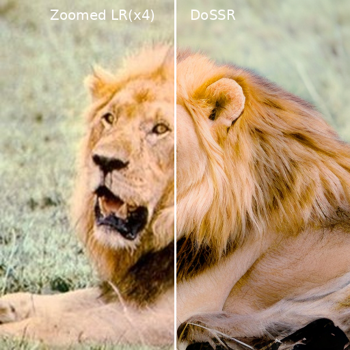

## Note!!! Our code is now open source🎉 and available at: https://github.com/AMD-AIG-AIMA/DoSSR.

<p align="center">
    
</p>

## [NeurIPS 2024] DoSSR: Taming Diffusion Prior for Image Super-Resolution with Domain Shift SDEs
<div style="display: flex; justify-content: space-between;"> 
   
</div>

## :date: Update
2024.11.26: Our code is now open source🎉 and available at: https://github.com/AMD-AIG-AIMA/DoSSR.

## :mag_right: Visual Results on Real-World Super-Resolution
<div style="display: flex; flex-wrap: wrap; justify-content: space-between; width: 100%;">
  
  
  
  
</div>


## :computer: Installation
```python
git clone https://github.com/AMD-AIG-AIMA/DoSSR
cd DoSSR

# create environment
conda create -n dossr python=3.10
conda activate dossr
pip install -r requirements.txt
```


## :globe_with_meridians: Inference
The model is available in two versions, supporting multi-step generation and single-step generation, respectively. The pre-trained model weights are available at [google drive](https://drive.google.com/drive/folders/1BTGRbAqXDSNWjyUnTLgDfmjd2xyu8GvP?usp=sharing). The difference between the multi-step and single-step generation models is the preprocessing module: Real-ESRNet for multi-step and Real-ESRGAN for single-step.

#### Multi-step Generation
```python
python inference.py \
--input [path/to/input_images] \
--config configs/model/cldm_v21.yaml \
--ckpt [path/to/model_weights(dossr_default.ckpt)] \
--steps 5 \  
--sr_scale 4 \
--color_fix_type wavelet \
--output [path/to/output_folder] \
--device cuda 
```

#### One-step Generation
```python
python inference.py \
--input [path/to/input_images] \
--config configs/model/cldm_v21.yaml \
--ckpt [path/to/model_weights(dossr_onestep.ckpt)] \
--steps 1 \
--sr_scale 4 \
--color_fix_type wavelet \
--output [path/to/output_folder] \
--device cuda 
```


## :hourglass: Train Model
#### Step 1: Datasets Preparation
Generate the file path list for the training and validation sets.
```python
python scripts/make_file_list.py \
--img_folder  [path/to/datasets] \
--val_size [val_size] \
--save_folder [path/to/save_folder] \
--follow_links 
```
#### Step 2: Create the initial model weights
1. Download the pretrained Stable Diffusion models from [HuggingFace](https://huggingface.co/stabilityai/stable-diffusion-2-1-base) and the preprocessing model weights from [Real-ESRGAN](https://github.com/xinntao/Real-ESRGAN). We use Real-ESRNet(RealESRNet_x4plus.pth) as the preprocessing model during training, as the artifacts introduced by the preprocessing model trained with GAN loss may incorrectly guide the generation model. 
2. Use the following script to merge these two weights.
```python
python scripts/make_init_weight.py \
--cldm_config configs/model/cldm_v21.yaml \
--sd_weight [path/to/sd_weights] \
--preprocess_model_weight [path/to/preprocess_model_weights] \
--output [path/to/save_weights]
```
#### [Optinal Step]: Pre-crop training samples to accelerate I/O.
```python
python scripts/sample_dataset.py \
--config configs/dataset/general_deg_realesrgan_train.yaml \
--sample_size [sample_size] \
--show_gt \
--output [path/to/save_folder]
```
#### Step 3: Start Training
```python
python scripts/train.py --config configs/train_cldm.yaml
```


## :smiling_face_with_three_hearts: Acknowledgement
Our code is based on [DiffBIR](https://github.com/XPixelGroup/DiffBIR) .Thanks for their awesome work.


## :pencil: Citation
If you find this method and/or code useful, please consider citing
```bibtex
@inproceedings{cuitaming,
  title={Taming Diffusion Prior for Image Super-Resolution with Domain Shift SDEs},
  author={Cui, Qinpeng and Zhang, Xinyi and Bao, Qiqi and Liao, Qingmin and Tian, Lu and Liu, Zicheng and Wang, Zhongdao and Barsoum, Emad and others},
  booktitle={The Thirty-eighth Annual Conference on Neural Information Processing Systems}
}
```


